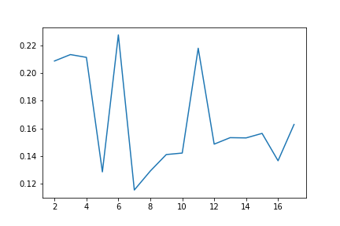

<h3 align = "center">基于《诗经》的文本分析</h1>


**摘要：**利用自然语言处理技术处理文学文本是计算语言学领域近年来的热门话题。本文使用现有的机器学习及自然语言处理技术，对《诗经》文本进行了分析、从字频、词频、文本长度、文本方差、情感分析、提取主题词等方面，对分词后的诗歌文本进行计算处理，统计建模，并在此基础上进行了主题演变和诗句相似度的探索性分析。

基于《诗经》语料的实验结果表明: 现有机器学习及自然语言处理技术可以对《诗经》文本做出一些有较好解释性的工作，验证已有的文学研究论点，并在传统的研究范式之外，对《诗经》研究提供了全新视角的宏观统计、可视化描述与阐释。

**关键字**：《诗经》；文本分析；情感分析；K-mean聚类；文本相似度

<h4 align = "center">引言</h4>

诗歌在中国是一个极为重要且历史悠久的文学体裁。纵横千年的时间跨度、数量巨大的诗人群体、卷帙浩繁的诗歌文本都使得在传统的文本阅读方式下，中国诗歌的宏观把握变得极其不易。因此，随着计算机算力与计算模型的发展，越来越多的研究者将目光聚焦到了使用计算机对诗歌进行文本分析的研究领域，已有研究者对中国古诗进行了统计建模与宏观分析$^{[1]}$，但所用文本语料多为《全唐诗》《全宋词》等，以《诗经》为语料的文本分析研究，未之有也。因此需要有人在这个方面进行一些探索，本文便是一次尝试， 试图从另一个视角出发，更高效地处理《诗经》文本，并提供文本分析视角下对《诗经》的宏观刻画、描述与阐释。
本文从字频、词频、文本长度、文本方差、情感分析、提取主题词等各个维度，对《诗经》进行了以下文本分析:

- 首先从单字的角度，对诗经进行了字数、字频、各句长度方差等统计。
- 经过效果对比，选用北京大学的分词工具Pkuseg，对《诗经》进行分词处理。
- 在分词基础上统计词频且生成词云。
- 通过文本长度，文本方差来寻找风雅颂三部分之间的差异。
- 通过对《诗经》中篇目的情感分析，绘制出风雅颂各部分的情感变化曲线。
- 提取出文本中的主题词，并以此为基础构建出每篇作品的文本向量。
- 选定文本长度，文本方差，文本向量作为作品的三个特征，共同组成一个样本来表达一篇作品。
- 抽取样本，通过计算距离的方式对《诗经》中风雅颂三部分进行聚类，绘制出表达聚类效果的轮廓系数曲线。
- 以束皙的六首《补亡诗》与陶渊明的四首《时运》为例，计算二者作品与《诗经》的相似程度。

<h4 align = "center">一：诗经简介
    </h4>
《诗经》是中国古代诗歌开端，最早的一部诗歌总集，收集了西周初年至春秋中叶（前11世纪至前6世纪）的诗歌，共311篇，其中6篇为笙诗，只有标题，没有内容。反映了周初至周晚期约五百年间的社会面貌。

《诗经》内容丰富，反映了劳动与爱情、战争与徭役、压迫与反抗、风俗与婚姻、祭祖与宴会，甚至天象、地貌、动物、植物等方方面面，是周代社会生活的一面镜子。$^{[2]}$

在两千余年后，“去风雅日远”$^{[3]}$的今日，对《诗经》的研究显得格外有价值，我们不仅能从中感受到“思无邪”的文学思致，也能从中发掘出上古社会的风貌与语言特点。

此外，计算机科学的发展对《诗经》的研究产生了新的助力，因此，本文尝试使用计算机对《诗经》进行文本分析研究。

<h4 align = "center">二：Python编程语言与自然语言处理工具简介</h4>
Python是一门易读、易维护，并且被大量用户所欢迎的、用途广泛的语言。在机器学习，自然语言处理等领域获得了广泛的应用。$^{[4]}$为了实现方便与理解方便，本文所有的程序都以python脚本的形式编写。

本文利用了许多基于Python的自然语言处理工具和绘图工具，如pkuseg(分词)，jieba(主题词提取)，sklearn(K-mean聚类)，snownlp(情感分析)， wordcloud(词云)，matplotlib(绘图)等。

<h4 align = "center">三：基于单字的《诗经》文本分析</h4>

首先以单个字为单位对《诗经》进行研究，去除标点符号与标题后，得出《诗经》中出现频率最高的20个字。

| 字   | 字频 | 字   | 字频 | 字   | 字频 | 字   | 字频 |
| :--- | ---- | ---- | ---- | ---- | ---- | ---- | ---- |
| 之   | 1021 | 不   | 631  | 我   | 588  | 其   | 542  |
| 有   | 534  | 子   | 458  | 于   | 383  | 兮   | 320  |
| 以   | 307  | 彼   | 306  | 无   | 296  | 人   | 266  |
| 维   | 260  | 如   | 247  | 既   | 226  | 尔   | 211  |
| 矣   | 207  | 君   | 199  | 王   | 193  | 言   | 180  |


而后，求出《诗经》的总字数为29667，去除掉重复的字，诗经中有2790个互不相同的字。

为了探究《诗经》中单字的使用频率，我们画了一张单字数量与所占文本比例的关系，如下图：


这张图表示，虽然《诗经》有2790个互不相同的字，但只需要大约500个字便可以表示百分之七十的内容，大约1000个非常用字只占了全部文本的百分之五。

出现频率前十的字中，有5个字都为无意义的停用词，这也与正常文本的语法特点相吻合。

<h4 align = "center">四：选择合适工具对《诗经》文本进行分词处理</h4>

中文自然语言处理与英文自然语言处理最大的不同之处就在于中文语言处理需要对文本进行分词处理，而分词处理也一向是中文自然语言处理中的重点难点。针对中文分词器，现已开发出了很多有用的工具。考虑到性能与评价，我们选择了三个分词工具进行测试：

- **Pkuseg：**Pkuseg是由北京大学语言计算与机器学习研究组研制推出的一套全新的中文分词工具包。Pkuseg官方给出与来自清华的THULAC和目前主流中文分词工具jieba的比较效果显示，Pkuseg的准确率远超于THULAC和jieba。$^{[5]}$
- **THULAC：**THULAC（THU Lexical Analyzer for Chinese）由清华大学自然语言处理与社会人文计算实验室研制推出的一套中文词法分析工具包，具有中文分词和词性标注功能。THULAC准确率高。该工具包在标准数据集Chinese Treebank（CTB5）上分词的F1值可达97.3％，词性标注的F1值可达到92.9％，与该数据集上最好方法效果相当。$^{[6]}$
- **jieba：**目前最主流的中文分词工具。但因其发布较早，有其滞后性。

我们选择《关雎》作为测试样本来评测三个分词工具的性能，测试结果如下：

<h5 align = "center">Pkuseg</h5>

```
['关关', '雎鸠', '在', '河之洲', '窈窕', '淑女', '君子好逑', '参差', '荇菜', '左右流之', '窈窕', '淑女', '寤寐求之', '求之不得', '寤寐', '思服', '悠哉悠哉', '辗转反侧', '参差', '荇菜', '左右', '采', '之', '窈窕', '淑女', '琴瑟友之', '参差', '荇菜', '左右芼之', '窈窕', '淑女', '钟鼓乐', '之']
```


<h5 align = "center">THULAC</h5>

	['关关', '雎鸠', '在', '河', '之', '洲', '窈窕淑女', '君子好逑', '参差', '荇菜',  '左右流之', '窈窕淑女', '寤寐求之', '求之不得', '寤寐思服', '悠', '哉', '悠', '哉',  '辗转反侧', '参差', '荇菜', '左右', '采', '之', '窈窕淑女', '琴', '瑟友之', '参差', '荇菜', '左右芼之', '窈窕淑女', '钟鼓乐之']
<h5 align = "center">jieba</h5>

	['关关雎', '鸠', '，', '在', '河之洲', '。', '窈窕淑女', '，', '君子好逑', '。', '参差', '荇', '菜', '，', '左右', '流之', '。', '窈窕淑女', '，', '寤寐求之', '。', '求之不得', '，', '寤寐', '思服', '。', '悠哉悠哉', '，', '辗转反侧', '。', '参差', '荇', '菜', '，', '左右', '采之', '。', '窈窕淑女', '，', '琴瑟', '友之', '。', '参差', '荇', '菜', '，', '左右', '芼', '之', '。', '窈窕淑女', '，', '钟', '鼓乐', '之', '。']

通过人工对样本分词效果进行评判，Pkuseg相对其它两个工具明显表现更好，故在本文中选用Pkuseg对文本进行分词处理。

<h4 align = "center">五：基于分词结果统计词频并制作词云</h4>

在用Pkuseg对文本进行了分词处理后，我们对其进行了词频统计，结果发现词频前十有九个都是单字，于是去掉单字，统计两字及以上的词语频率，最终得到前二十的词频为；

| 词   | 词频 | 词   | 词频 | 词   | 词频 | 词       | 词频 |
| ---- | ---- | ---- | ---- | ---- | ---- | -------- | ---- |
| 君子 | 136  | 文王 | 32   | 兄弟 | 28   | 四方     | 27   |
| 不可 | 24   | 上帝 | 24   | 父母 | 19   | 可以     | 18   |
| 如何 | 18   | 威仪 | 17   | 天子 | 17   | 岂弟君子 | 16   |
| 悠悠 | 15   | 他人 | 15   | 申伯 | 14   | 肃肃     | 13   |
| 黄鸟 | 13   | 至于 | 13   | 四国 | 13   | 之子于归 | 12   |

又基于分词结果绘制出词云，词语大小与词语频率成正相关，如下图：
　　


<h4 align = "center">六：对比风雅颂差异</h4>

诗经六义：“风，雅，颂，赋，比，兴。”，后三种是手法，而前三种是分类。

- 《风》出自各地的民歌，是《诗经》中的精华部分有对爱情、劳动等美好事物的吟唱，也有怀故土、思征人及反压迫、反欺凌的怨叹与愤怒，常用复沓的手法来反复咏叹，一首诗中的各章往往只有几个字不同，表现了民歌的特色。

- 《雅》分《大雅》、《小雅》，多为贵族祭祀之诗歌，祈丰年、颂祖德。《大雅》的作者是贵族文人，但对现实政治有所不满，除了宴会乐歌、祭祀乐歌和史诗而外，也写出了一些反映人民愿望的讽刺诗。《小雅》中也有部分民歌。

- 《颂》则为宗庙祭祀之诗歌。《雅》、《颂》中的诗歌对于考察早期历史、宗教与社会有很大价值。$^{[2]}$
  为了探究风雅颂三部分不同的作品在文本层次的差异，我们先对各部分中每篇作品的字数进行了统计。

  | 《风》部分篇目平均长度 | 《雅》部分篇目平均长度 | 《颂》部分篇目平均长度 |
  | ---------------------- | ---------------------- | ---------------------- |
  | 66.65                  | 152.43                 | 74.95                  |

从统计结果上来看，《风》部分的长度是最短的，而《雅》部分的长度是最长的，是《风》和《颂》的两倍以上。

为了更好地探究风雅颂各部分篇目的句式灵活度，我们定义一个值叫做文本方差，记作$Var(i)$，
已知：

$$i = 被测量文本方差的篇目$$

$$number(i) = i中句子的数量$$

$$sentence(i, n) = i中的第n个句子$$

$$s = 一个句子$$

$$length(s) = 句子长度$$

$$mean(i)= i中每句诗的平均长度$$

则$Var(i)$与$mean(i)$的公式为：
$$
mean(i) = \frac{\sum_{n = 1}^{number(i)}length(sentence(i, n))}{number(i)}
，
Var(i) = \frac{\sum_{n = 1}^{number(i)}(length(sentence(i, n)) - mean(i))^2}{number(i)}
$$
根据公式易得，每篇文本中，各句字数变化越大，即句式越灵活的篇目，则文本方差越大。风雅颂各部分的平均文本方差为：

| 风部分篇目平均文本方差 | 雅部分篇目平均文本方差 | 颂部分篇目平均文本方差 |
| ---------------------- | ---------------------- | ---------------------- |
| 1.29                   | 0.80                   | 1.48                   |

从中可以得出结论：《雅》的句式是相对固定，而《颂》的句式相对灵活，长短变化有致。

<h4 align = "center">七：风雅颂情感分析</h4>
为了对文本内涵做更深一步的了解，我们可以利用一个叫做snownlp的文本分析工具对《诗经》中的篇目做情感分析，该工具会返回一个介于0与1之间的数值，数值越大，表示文本中的情感越趋向于正面，数值越小，文本中的情感越趋向于负面。

以下为风雅颂各部分的平均情感指数：

| 风部分篇目平均情感指数 | 雅部分篇目平均情感指数 | 颂部分篇目平均情感指数 |
| ---------------------- | ---------------------- | ---------------------- |
| 0.54                   | 0.5                    | 0.59                   |

可以看出，《诗经》整体表达的情感略为偏向于正面，而《颂》多是祭祀称赞祖先的颂歌，表达的情绪较为正面，故在风雅颂三部分中得分最高。

以下为风雅颂三部分的情感波动曲线

| 风部分篇目情感波动曲线                                       | 雅部分篇目情感波动曲线                                       | 颂部分篇目情感波动曲线                                       |
| ------------------------------------------------------------ | ------------------------------------------------------------ | ------------------------------------------------------------ |
|  |  |  |

从这三幅图可以看出：《风》的情感曲线波动较大，极差也较大。而《颂》的波动较小，极差也较小，且整体偏向函数值域的上半部分。
　　这些结果表明了《风》部分的作品反应了当时人们各种各样，多姿多彩的生活，有求爱诗，有弃妇诗，情感波动较大，而《颂》则显得千篇一律，没有较大的波动，且大多数篇目情感都趋向于正面，得分最低的也在0.45以上，与《颂》的特点非常吻合。

<h4 align = "center">七：风雅颂主题词提取</h4>
jieba中的extract_tags() 函数可以使用默认的TF-IDF模型对文档进行分析。我们用此函数对风雅颂三部分的篇目进行处理，得到每个部分的主题词及其权重：

| 《风》部分主题词（权重前20） | 《雅》部分主题词（权重前20）   | 《颂》部分主题词（权重前20） |
| ---------------------------- | ------------------------------ | ---------------------------- |
| 君子, 0.15306538650828       | 君子, 0.21368451879339007      | 鲁侯, 0.09276407350566038    |
| 采采, 0.0500424395472        | 文王, 0.06520760803798784      | 降福,0.08681345191849056     |
| 不可, 0.046026412204248      | 昊天, 0.06153998434126367      | 文王,0.08438028524412579     |
| 悠悠, 0.045892619951048      | 四方, 0.047654274840522474     | 薄言, 0.0830662293798742     |
| 之子, 0.043991765092464      | 岂弟君子, 0.046482692599368165 | 淮夷, 0.07899389016981131    |
| 薄言, 0.04226409750848       | 忧心, 0.04152885814939976      | 于乎, 0.07518721699937106    |
| 他人, 0.038834059403272      | 申伯, 0.03945888112417983      | 无疆, 0.07179730190062893    |
| 肃肃,0.038255256009279995    | 天子, 0.03597762091130012      | 牡马, 0.06645298350389937    |
| 羔裘, 0.038255256009279995   | 维其, 0.034862019449526126     | 保之, 0.06014977359949685    |
| 齐子, 0.038255256009279995   | 上帝, 0.03454021184757473      | 眉寿, 0.06014977359949685    |
| 振振, 0.03584578301724       | 福禄, 0.034129146268578374     | 下国, 0.06014977359949685    |
| 叔兮伯兮, 0.03347334900812   | 威仪, 0.033090659866128795     | 汤孙, 0.06014977359949685    |
| 不尔思, 0.03347334900812     | 公尸, 0.03195685116206561      | 四方, 0.05919919727358491    |
| 何以, 0.031008837424239998   | 黄鸟, 0.028886457896136086     | 夙夜, 0.05835518268679245    |
| 东门, 0.030968497027548      | 兄弟, 0.025132648786119077     | 后稷, 0.055685355008301886   |
| 父母, 0.03066268851504       | 嘉宾, 0.024902217699936814     | 陟降, 0.04983973762792453    |
| 委蛇, 0.03003451989816       | 南山, 0.024157200158376677     | 武王, 0.048084891723874215   |
| 兄弟, 0.029877134373632      | 翼翼, 0.023646353235479953     | 上帝, 0.04704831901779874    |
| 劳心, 0.029493469101600004   | 维此, 0.023241346299684083     | 皇考, 0.045694030878113204   |
| 素丝, 0.028691442006959996   | 维彼, 0.023241346299684083     | 缉熙, 0.04511233019962264    |

通过对以上三部分的主题词进行观察，我们可以发现各个部分的主题词反应了它们所在部分的特征：

- 《风》的主题词有采采，之子，他人，东门，父母，兄弟，这几个词勾勒出了普通民众的生活。
- 《雅》的主题词有岂弟君子，申伯，福禄，威仪，嘉宾，这些词反应了作者贵族的身份。
- 《颂》的主题词有鲁候，降福，文王，无疆，保之，眉寿，四方，后稷，武王，上帝，揭示了这些作品祭天敬祖的作用。

<h4 align = "center">八：篇目特征聚合</h4>
​        计算机无法直接处理文字，只有将文字编码为数字，才能使用计算机对其进行文本分析，于是我们可以将《诗经》中的某篇作品编码为一些数字，然后对其进行文本分析。

　　首先我们提取出《诗经》中权重最大的64个主题词：
	
	key_word = ['君子', '文王', '昊天', '四方', '薄言', '忧心', '岂弟君子',
	 '黄鸟', '上帝', '兄弟', '不可', '威仪', '天子', '申伯', '肃肃', '福禄',
	 '悠悠', '南山', '维其', '父母', '维此', '公尸', '采采', '莫不', '四国',
	 '德音', '于乎', '之子', '振振', '赫赫', '翼翼', '施于', '硕人', '实维',
	 '黍稷', '至止', '夙夜', '他人', '万年', '嘉宾', '后稷', '饮酒', '寿考',
	 '召伯', '羔裘', '维予', '齐子', '旨酒', '维彼', '鼓钟', '尔肴', '武王',
	 '何以', '征夫', '王命', '小子', '曾孙', '罔极', '不见', '如何', '至于',
	 '淮夷', '叔兮伯兮', '大邦']
　　然后将作品编码为文本向量：生成一个64个元素全为0的数组，与64个关键词出现的次数相对应，遍历文本，如果发现关键词，数组对应的元素设为一。文本遍历完成后，返回已经修改过的数组，即为我们所要求的一维向量。

　　之后便是特征聚合：我们将文本方差作为一个文本特征，文本向量也作为一个特征，两个特征聚合，我们就得到了一个样本点代表一篇作品，该样本点包含一个数字与一个数组。
　　如《鲁颂·閟宫》

	[0.22703367256334953, array([0., 0., 0., 0., 0., 0., 0., 0., 2., 0., 0., 0., 0., 0., 0., 0., 0.,0., 0., 0., 0., 0., 0., 0., 0., 0., 0., 0., 0., 0., 0., 0., 0., 1.,1., 0., 0., 0., 0., 0., 1., 0., 0., 0., 0., 0., 0., 0., 0., 0., 0.,0., 0., 0., 0., 0., 0., 0., 0., 0., 1., 1., 0., 0.])]

距离计算：我们通过计算两向量之间的欧式距离来评判两篇作品的相似程度
两向量的欧式距离记作$instance(i, j)$，
已知：

$$i, j 为两向量$$

$$length(i) = 向量i中元素数目$$
$$i[n] = 向量i中第n个元素$$

则欧氏距离计算方式为：

$$instance(i, j) =\sqrt{\sum_{n = 1}^{length(i)}(i[n] - j[n])^2}$$

<h4 align = "center">九：风雅颂篇目K-mean聚类</h4>
　　K-mean聚类算法（k-means clustering algorithm）是一种迭代求解的聚类分析算法，其步骤是，预将数据分为K组，则随机选取K个对象作为初始的聚类中心，然后计算每个对象与各个种子聚类中心之间的距离，把每个对象分配给距离它最近的聚类中心。聚类中心以及分配给它们的对象就代表一个聚类。每分配一个样本，聚类的聚类中心会根据聚类中现有的对象被重新计算。这个过程将不断重复直到满足某个终止条件。终止条件可以是没有（或最小数目）对象被重新分配给不同的聚类，没有（或最小数目）聚类中心再发生变化，误差平方和局部最小。$^{[7]}$

　　K-mean算法适合用来将未标记的多组数据根据距离聚合为不同类别，聚合效果越好，轮廓系数越接近于1。

　　我们已经定义了欧式距离，此刻再从风雅颂中各抽出40篇作品，将其编码为样本点，随后为了方便计算，将每个样本点中前两个特征加入到第三个特征——64元素的数组中，然后将此120个样本点进行K-mean并绘制出轮廓系数的曲线图。

　　由图中可以看出，聚类效果最好的是六类，分为三类的聚类效果不如分为六类。因此我们可以推断，将《诗经》中作品以六种风格来划分，比用风雅颂三种题材来划分更合适，也就是说，风雅颂之间的差别，比不同风格之间的差别要小。

<h4 align = "center">十：束皙陶渊明仿诗经作品相似度比较</h4>
　　束皙的六首《补亡诗》与陶渊明的四首《时运》都是仿诗经的作品，历来为人所称道，那么二人中谁的作品在文本上与诗经相似度最高？我们通过计算二者作品与诗经中篇目的平均距离得到了答案：

| 人物 | 平均距离          |
| ---- | ----------------- |
| 束皙 | 2.325850968950027 |
| 陶潜 | 2.517203832441414 |


束皙的距离显著低于陶潜，因此束皙的作品在文本方面比陶渊明更接近于《诗经》。

然而，相似与否从来不是评判文学作品的标准，陶潜的《时运》虽然可以看出与《诗经》有着明显的不同，但他是借《诗经》四言诗的传承来浇自己胸中块垒，得到了“思无邪”的真谛，沈德潜对其评价是：”他人学三百篇，痴而重，与风雅日远。此不学三百篇，清而腴，与风雅日近。”。在文学意义上，陶渊明的作品要远远高于束皙。然而这种幽微的情感是我们暂时还无法衡量的，这也是文本分析的一个劣势。

<h4 align = "center">十一：结语</h4>
诗歌中蕴含着人类对自然风景、人文思想、历史进程、匠心独造、生活事迹，等等诸多方面的思考，同时也抒发着厚重的情感，是人类的瑰宝。（基于深度学习的中国诗歌自动生成算法研究）其中很多东西是我们无法用计算机文本分析的手段来衡量的。当然，与之相对的，诗歌也有很多的特性是可以被计算机所分析的。计算机不能代替人类对诗歌的研究，但可以作为辅助的工具。本文就是对于这个想法的一次实践。


<h4>参考文献</h4>

[1]钱鹏,黄萱菁.中国古诗统计建模与宏观分析[J].江西师范大学学报(自然科学版),2015,39(02):117-123.

[2]https://baike.baidu.com/item/%E8%AF%97%E7%BB%8F/168138

[3] (清)沈德潜 ,古诗源/中国古典文学基本丛书.ISBN号：	9787101130607

[4]https://baike.baidu.com/item/Python/407313

[5]https://github.com/lancopku/PKUSeg-python

[6]http://thulac.thunlp.org

[7]https://baike.baidu.com/item/K%E5%9D%87%E5%80%BC%E8%81%9A%E7%B1%BB%E7%AE%97%E6%B3%95

